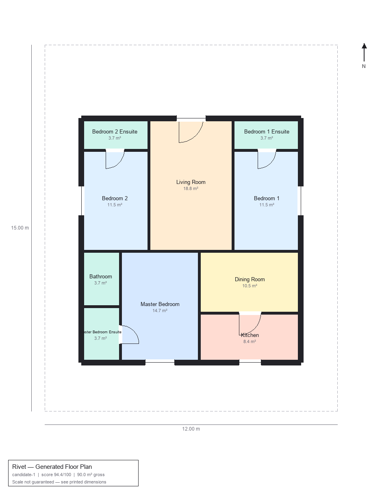
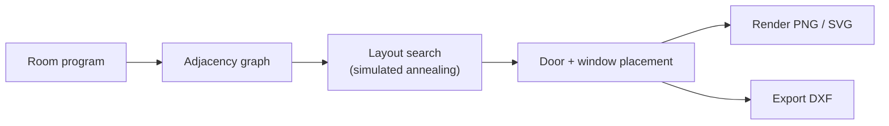

# Rivet

[](https://github.com/Mayan10/Rivet/actions/workflows/ci.yml)
[](LICENSE)
[](pyproject.toml)

**Rivet designs floor plans.** Give it a plot and a room program (types,
counts, target areas, entrance orientation), and it builds a room-adjacency
graph, searches guillotine-cut layouts with simulated annealing against a
residential design rulebook, renders the winning candidates itself, and
exports each one to a real, layered DXF file — ready to open in AutoCAD,
LibreCAD, QCAD, or any DXF-compatible CAD tool.

Nothing here is a lookup. Every wall, door, and window is generated from
the room program you give it.

<p align="center">
  
</p>

<sub>Generated by `rivet generate --width 15 --length 13 --road-width 9 --height 6 --room living_room --room master_bedroom+ensuite --room bedroom:2+ensuite --room kitchen --room dining_room --room bathroom --seed 42` — nothing in this image is hand-placed, and every room here clears its cited TNCDBR 2019 legal minimum.</sub>

## Features

- **Generative, not retrieval-based** — layouts are synthesized per request
  from a constraint search, not matched against a dataset of existing plans.
- **Hard code minimums, not just soft suggestions** — room dimensions,
  setbacks, and certain adjacency rules are cited (TNCDBR 2019 by default)
  and enforced by a real validator: a layout that fails one is never
  returned, ever, even if it scored well. If nothing satisfies every hard
  constraint, you get an explicit, explainable `InfeasibleResult` with the
  specific violations and their citations — never a silent code violation.
  See [`docs/design_rules.md`](docs/design_rules.md).
- **Ranked candidates, not one answer** — each request returns several
  distinct high-scoring layouts with a transparent score breakdown, so you
  can see *why* one beat another.
- **Real quantity metrics, computed once** — carpet/built-up/plinth area,
  ground coverage, FSI consumed vs. the cited TNCDBR cap, a setback
  compliance table, door/window schedules, and a wall-length/plaster/
  block-count takeoff, all from one `core/metrics.py` that every renderer,
  the DXF exporter, and the API read — not recomputed four different ways.
- **Self-rendering** — PNG and SVG renderers draw the generated geometry
  directly (walls, door swings, window breaks, dimensions, north arrow,
  title block). No external imagery anywhere in the path.
- **Real CAD export** — millimetre-coordinate DXF with AIA CAD Layer
  Guidelines layers, BLOCK/INSERT symbols with ATTDEF/ATTRIB (doors,
  windows, fixtures, north arrow, title block) so AutoCAD DATAEXTRACTION
  can build a schedule from the file, masonry hatch on true wall
  boundaries, per-room dimension chains, and a paper-space sheet with a
  scale-locked viewport, title block, and door/window/room schedules —
  not a soup of unlabeled traced line segments. See
  [`docs/architecture.md`](docs/architecture.md).
- **Optional vastu scoring, never mixed with code compliance** — disabled
  by default; enable it per-request with an explicit `plot_north` and it
  reports directional preferences (kitchen SE, master bedroom SW, pooja
  NE, toilet-avoid-NE, entrance orientation) as their own field, always
  structurally separate from cited hard constraints. See
  [`docs/design_rules.md`](docs/design_rules.md#vastu-corevastupy-phase-5--optional-uncited-soft-only).
- **CLI, API, and web UI** — script it, integrate it, or just use the form.
- **Lightweight** — no ML framework, no GPU, no system dependencies like
  Graphviz or Tesseract. `pip install -e .` and go.

## How it works



Full detail, including why a slicing-tree + simulated-annealing search
instead of a learned model, is in [`docs/architecture.md`](docs/architecture.md).

## Quickstart

```bash
git clone https://github.com/Mayan10/Rivet.git
cd Rivet
python3 -m venv .venv && source .venv/bin/activate
pip install -e ".[dev]"
```

### CLI

```bash
rivet generate \
  --width 15 --length 13 --entrance north \
  --road-width 9 --height 6 \
  --room living_room \
  --room master_bedroom+ensuite \
  --room bedroom:2+ensuite \
  --room kitchen \
  --room dining_room \
  --room bathroom \
  --candidates 3 --seed 42 \
  --out-dir output
```

`--road-width` and `--height` feed the TNCDBR_2019 setback table (Rule 35,
keyed by abutting road width and building height); omit them and Rivet
falls back to documented, non-cited assumptions. Add `--ruleset generic`
to use the uncited placeholder ruleset instead.

Writes `output/candidate-{1,2,3}.{png,svg,dxf}`. Room specs are
`type[:count][=area_sqm][+ensuite]`, e.g. `bedroom:2=12.5+ensuite`.

```bash
rivet room-types      # list valid room type identifiers
rivet rules           # print the design rulebook as JSON
```

### Web UI + API

```bash
python scripts/run_dev_server.py
# -> http://127.0.0.1:5000
```

Or hit the API directly:

```bash
curl -X POST http://127.0.0.1:5000/api/v1/generate \
  -H "Content-Type: application/json" \
  -d '{
    "plot": {"width_m": 15, "length_m": 13, "entrance": "north"},
    "rooms": [
      {"room_type": "living_room", "count": 1},
      {"room_type": "master_bedroom", "count": 1, "attached_bathroom": true},
      {"room_type": "bedroom", "count": 2, "attached_bathroom": true},
      {"room_type": "kitchen", "count": 1},
      {"room_type": "dining_room", "count": 1},
      {"room_type": "bathroom", "count": 1}
    ],
    "num_candidates": 3
  }'
```

Returns each candidate's score breakdown, inline SVG/PNG preview, and a
`/download/<token>.dxf` URL.

### As a library

```python
from rivet.core.models import GenerationRequest, PlotSpec, RoomRequirement, RoomType
from rivet.core.generator import generate
from rivet.export.dxf import export_dxf

request = GenerationRequest(
    plot=PlotSpec(width_m=12.0, length_m=15.0),
    rooms=[
        RoomRequirement(RoomType.LIVING_ROOM),
        RoomRequirement(RoomType.BEDROOM, count=2, attached_bathroom=True),
        RoomRequirement(RoomType.KITCHEN),
    ],
)
layouts = generate(request)          # ranked list of Layout candidates
export_dxf(layouts[0], "plan.dxf")
```

## Project structure

```
src/rivet/
├── core/       # generation engine: models, rulebook, graph, layout
│               # search, scoring, opening placement — no I/O
├── render/     # PNG + SVG renderers, driven purely by Layout geometry
├── export/     # DXF export (ezdxf)
├── api/        # Flask API
└── cli.py      # scriptable entry point
web/            # the web UI (thin client over the API)
tests/          # pytest suite
docs/           # design rules + architecture
```

## Limitations

- **Single storey.** `PlotSpec.num_floors` exists but only the ground floor
  is currently generated — multi-storey stacking (staircase alignment,
  structural continuity across floors) is on the roadmap; see
  [`CONTRIBUTING.md`](CONTRIBUTING.md).
- **Design guidance, not a stamped drawing.** The rulebook encodes common
  residential space-planning practice, not your local building code. Always
  have construction-intent drawings reviewed by a licensed engineer/architect.
- Setback tiers are a simplified function of plot area — real setback
  requirements are jurisdiction-specific.

## Contributing

See [`CONTRIBUTING.md`](CONTRIBUTING.md) for dev setup, project layout, and
where contributions are most useful (rulebook corrections with a cited
rationale are especially welcome). Please also read the
[Code of Conduct](CODE_OF_CONDUCT.md).

## License

[MIT](LICENSE).

## Acknowledgments / project history

Rivet is a ground-up rebuild of an earlier prototype that matched user
requirements against the [CubiCasa5K](https://www.kaggle.com/datasets/qmarva/cubicasa5k)
dataset (Kalervo et al., *"CubiCasa5K: A Dataset and an Improved Multi-Task
Model for Floorplan Image Analysis,"* ICPR 2020; CC BY-NC 4.0) via
nearest-neighbor lookup, then traced the closest dataset image into a DXF.
That approach is no longer part of Rivet — see [`CHANGELOG.md`](CHANGELOG.md)
for what replaced it and why. The dataset is credited here for historical
accuracy; the current engine has no runtime dependency on it.
