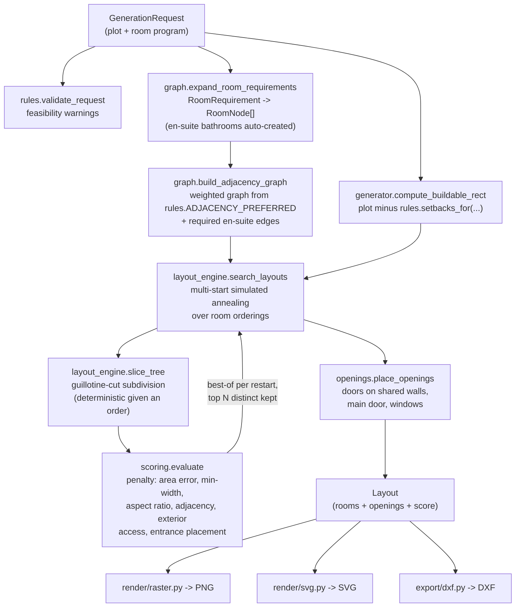

# Architecture

## Request flow

## Why a slicing tree + simulated annealing

A **guillotine slicing tree** (recursively cut a rectangle in two, recurse
into each half) has one useful property for this problem: *any* ordering of
rooms produces a valid tiling — no overlaps, full coverage of the buildable
rectangle, by construction. That means the search never has to reject or
repair invalid geometry; every candidate the optimizer considers is already
a legal floor plan. It only has to get *better*.

That reduces "design a floor plan" to "find a good permutation of rooms,"
which is a well-trodden problem — slicing-tree optimization via simulated
annealing is a classic technique in floorplanning literature (originally
VLSI chip layout, since applied to architectural space planning). Rivet:

1. Seeds several initial orderings per generation request — sorted by
   target area, a graph-guided traversal that keeps adjacency-linked rooms
   near each other in sequence (living room as hub, then its neighbors,
   etc.), and pure random shuffles for diversity.
2. Runs simulated annealing on each (swap two rooms' positions, or reverse
   a sub-range of the ordering; accept improving moves always, worse moves
   with probability `exp(-Δpenalty / temperature)`, cooling geometrically).
3. Scores every candidate ordering by rebuilding its slice tree and running
   it through `scoring.evaluate` — see [`design_rules.md`](design_rules.md)
   for what's actually being scored.
4. Keeps the best result across all restarts, de-duplicates near-identical
   geometries, and returns the top N distinct candidates.

The split axis at each recursion is always the rectangle's *longer* side,
and the split point is the prefix whose cumulative target area is closest
to half the group's total — both bias the search toward squarer, more
usable rooms without needing to be told to.

## Determinism

`GenerationRequest.seed` is expected to make two calls with identical
inputs produce byte-identical output — including across separate process
invocations, not just within one Python session. That guarantee was broken
once during development by an innocuous-looking `set(...)` in the ordering
search: Python randomizes string-hash seeding per process by default
(`PYTHONHASHSEED`), so a `set`'s iteration order — and therefore which
`rng.random()` draw landed on which room — differed between runs even with
the same explicit seed. Fixed by using an insertion-ordered `dict` instead
(see `core/layout_engine.py::_graph_guided_order`). If you add a new
collection to anything in the search hot path, prefer `list`/`dict` over
`set` unless you're certain nothing downstream depends on iteration order.

## Why no dataset, no ML model

The original prototype (see `CHANGELOG.md`) matched user requirements
against CubiCasa5K floor plan images via nearest-neighbor lookup on room
counts/areas, then traced the closest *existing* image with OpenCV contour
detection. It never designed anything new, and the output quality was
capped by how close the dataset happened to have something similar.

A learned model (e.g. a graph-conditioned GAN, in the spirit of the
House-GAN research this repo used to carry unused template code for) is a
reasonable longer-term direction, but training one needs a labeled dataset,
a training pipeline, and GPU infrastructure that a repository like this
doesn't have out of the box. The constraint-based search here has no such
dependency, runs in well under a second on a laptop CPU, and — because the
rulebook is explicit, readable Python rather than weights in a checkpoint
— every design decision it makes is traceable to a named rule.
