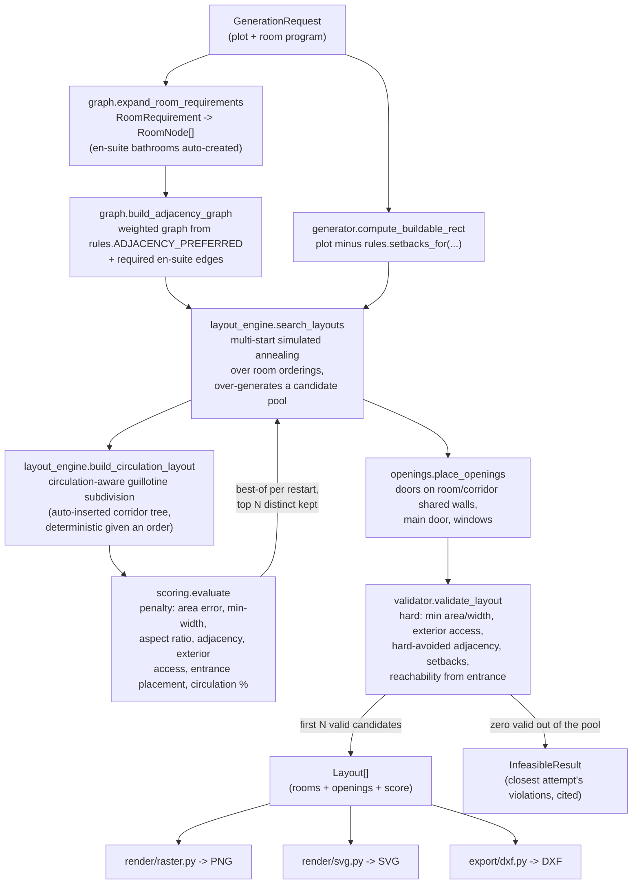

# Architecture

## Request flow

## Why a slicing tree + simulated annealing

A **guillotine slicing tree** (recursively cut a rectangle in two, recurse
into each half) has one useful property for this problem: *any* ordering of
rooms produces a valid tiling — no overlaps, full coverage of the buildable
rectangle, by construction. That means the search never has to reject or
repair invalid geometry; every candidate the optimizer considers is already
a legal floor plan. It only has to get *better*.

That reduces "design a floor plan" to "find a good permutation of rooms,"
which is a well-trodden problem — slicing-tree optimization via simulated
annealing is a classic technique in floorplanning literature (originally
VLSI chip layout, since applied to architectural space planning). Rivet:

1. Seeds several initial orderings per generation request — sorted by
   target area, a graph-guided traversal that keeps adjacency-linked rooms
   near each other in sequence (living room as hub, then its neighbors,
   etc.), and pure random shuffles for diversity.
2. Runs simulated annealing on each (swap two rooms' positions, or reverse
   a sub-range of the ordering; accept improving moves always, worse moves
   with probability `exp(-Δpenalty / temperature)`, cooling geometrically).
3. Scores every candidate ordering by rebuilding its slice tree and running
   it through `scoring.evaluate` — see [`design_rules.md`](design_rules.md)
   for what's actually being scored.
4. Keeps the best result across all restarts, de-duplicates near-identical
   geometries, and returns the top N distinct candidates.

The split axis at each recursion is always the rectangle's *longer* side,
and the split point is the prefix whose cumulative target area is closest
to half the group's total — both bias the search toward squarer, more
usable rooms without needing to be told to.

## Circulation

A plain slicing tree guarantees a valid *tiling* (no overlaps, full
coverage) but says nothing about whether the result is a *navigable
house* — the Phase 0 audit's most severe finding was that a generated
layout could place a room with no door-reachable route back to the
entrance. `layout_engine.build_circulation_layout` extends the same
permutation-driven recursion with one added rule: a corridor is always
inserted at the root (oriented toward the entrance wall), and again
wherever a sub-cluster still holds more than
`CIRCULATION_SINGLE_LOAD_THRESHOLD` primary rooms — otherwise the cluster
is placed directly, with every split forced to run parallel to the
corridor-facing edge so every resulting room touches it. Because a
subtree's room count can never exceed its parent's, this rule is
monotonic top-down: any corridor inserted below the root implies every
ancestor split up to the root was *also* a corridor split, so the whole
corridor tree is transitively connected back to the entrance by
construction — reachability doesn't depend on the search finding it, only
on this rule always being applied the same way for a given room ordering.
The search itself needed zero new move types to support this: the
corridor tree, like room geometry always was, is a pure function of the
room ordering being annealed over.

Construction alone wasn't the whole story, though — see
[`design_rules.md`](design_rules.md#circulation) for the belt-and-suspenders
validator check this needed anyway, and the real geometry/floating-point
bugs it caught that construction didn't prevent.

## Determinism

`GenerationRequest.seed` is expected to make two calls with identical
inputs produce byte-identical output — including across separate process
invocations, not just within one Python session. That guarantee was broken
once during development by an innocuous-looking `set(...)` in the ordering
search: Python randomizes string-hash seeding per process by default
(`PYTHONHASHSEED`), so a `set`'s iteration order — and therefore which
`rng.random()` draw landed on which room — differed between runs even with
the same explicit seed. Fixed by using an insertion-ordered `dict` instead
(see `core/layout_engine.py::_graph_guided_order`). If you add a new
collection to anything in the search hot path, prefer `list`/`dict` over
`set` unless you're certain nothing downstream depends on iteration order.

**Known limit, found 2026-08-13 via a CI failure on Python 3.11 (passing on
3.12/3.13) for one specific seed + room program**: this guarantee holds
per Python build, not across different ones. `random.Random`'s own output
(`.random()`, `.sample()`, `.shuffle()`) is bit-identical across the
3.10–3.13 range checked, but `_anneal`'s accept/reject step
(`rng.random() < math.exp(-delta / temperature)`) calls `math.exp()`,
which delegates to the platform's C library and isn't guaranteed
bit-identical across interpreter builds. A ~1-ULP difference there is
usually harmless, but 400 iterations × several restarts gives it room to
compound into a genuinely different search trajectory -- observed
concretely: two Python versions landed on different `bool` outcomes for
whether a *marginal* request (right at the edge of the reachability hard
constraint) was feasible at all. Comfortably-feasible requests are
unaffected; a request sitting exactly on a feasibility boundary can, in
principle, come back valid on one Python build and `InfeasibleResult` on
another for the identical seed. No fix has been attempted -- removing the
sensitivity would mean changing the acceptance rule itself (a search-
algorithm change, so per CLAUDE.md that needs sign-off first) -- so for
now, avoid asserting feasibility for a request sitting exactly on a
margin; give it more candidates/pool size or more slack instead (see
`tests/test_api.py::test_generate_with_vastu_enabled_returns_preferences`
for the pattern).

## Vastu (`core/vastu.py`, Phase 5)

An optional, disabled-by-default soft scoring module plugged directly
into `scoring.evaluate` (`vastu: VastuOptions | None` parameter, threaded
through `layout_engine.search_layouts`/`_anneal` alongside everything
else the annealer already scores). It adds a `"vastu"` key to
`breakdown` only when enabled, so a disabled request's search behaves
exactly as it did before this module existed — see
[`design_rules.md`](design_rules.md#vastu-corevastupy-phase-5--optional-uncited-soft-only)
for the direction math and preference list. Structurally, the actual
per-preference results never enter `breakdown` (a plain `dict[str,
float]`) — they live in their own `Layout.vastu_preferences` list, kept
separate so a caller can never conflate a vastu preference with a cited
code-compliance figure.

## DXF export (`export/dxf/`, Phase 4)

A package, not a single module: `units.py` (the one place metres become
millimetres), `layers.py` (AIA CAD Layer Guidelines names by default,
`layer_scheme="legacy"` for the pre-Phase-4 names), `blocks.py`
(BLOCK/INSERT/ATTDEF for doors, windows, north arrow, and schematic
fixtures), `walls_geometry.py` (true wall-boundary polylines + masonry
hatch), `dimensions.py` (overall + per-room chains, `DIMSCALE` tied to a
fixed 1:100 print scale), `sheet.py` (a paper-space `Sheet` layout with a
scale-locked viewport, title block, and door/window/room schedules read
from `core/metrics.py`), and `core.py` (orchestrates the above into
`build_document`/`export_dxf`/`export_dxf_bytes`, the same public names
the module exported before the rewrite). Title block metadata
(project/client/date/sheet/revision) is an export-time keyword argument
(`TitleBlockInfo`), not a `GenerationRequest`/`Layout` field — core stays
unaware of anything document-metadata-shaped, per CLAUDE.md's layer
separation rule.

## Why no dataset, no ML model

The original prototype (see `CHANGELOG.md`) matched user requirements
against CubiCasa5K floor plan images via nearest-neighbor lookup on room
counts/areas, then traced the closest *existing* image with OpenCV contour
detection. It never designed anything new, and the output quality was
capped by how close the dataset happened to have something similar.

A learned model (e.g. a graph-conditioned GAN, in the spirit of the
House-GAN research this repo used to carry unused template code for) is a
reasonable longer-term direction, but training one needs a labeled dataset,
a training pipeline, and GPU infrastructure that a repository like this
doesn't have out of the box. The constraint-based search here has no such
dependency, runs in well under a second on a laptop CPU, and — because the
rulebook is explicit, readable Python rather than weights in a checkpoint
— every design decision it makes is traceable to a named rule.
